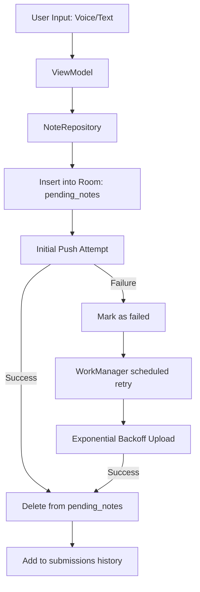
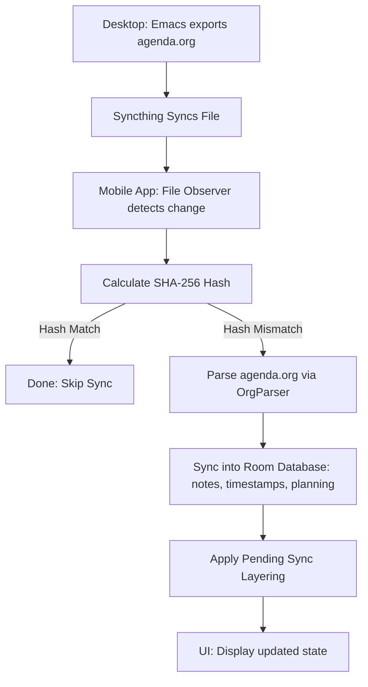
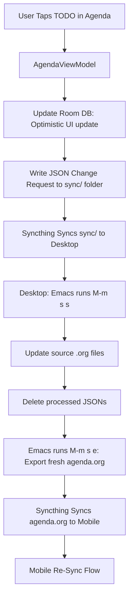
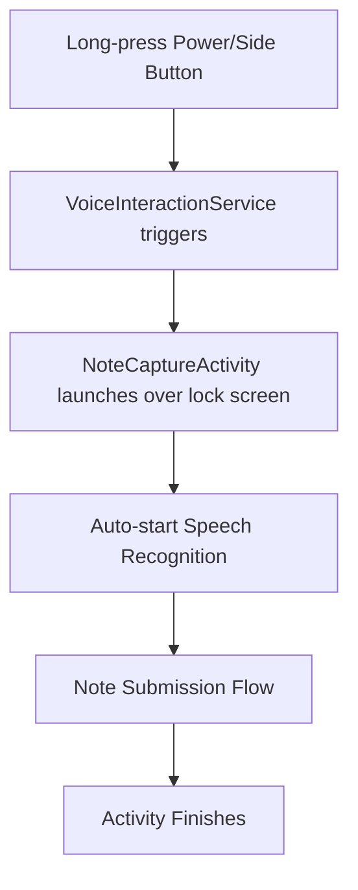

# Data & System Flows

This document visualizes and describes the primary data flows within the Note Taker application.

## 1. Note Capture & GitHub Upload Flow

This flow describes how a note moves from the user's voice/text input to your GitHub repository.

---

## 2. Agenda Synchronization Flow (Desktop to Mobile)

This flow describes how the app refreshes the agenda view based on changes from your desktop.

---

## 3. TODO State Update Flow (JSON Sync)

This flow describes how changing a task's status on your phone updates your desktop source files.

---

## 4. Voice Interaction Flow (Lock Screen)

This flow describes how the app handles a voice capture when the phone is locked.

---
*Last Updated: 2026-03-04*
